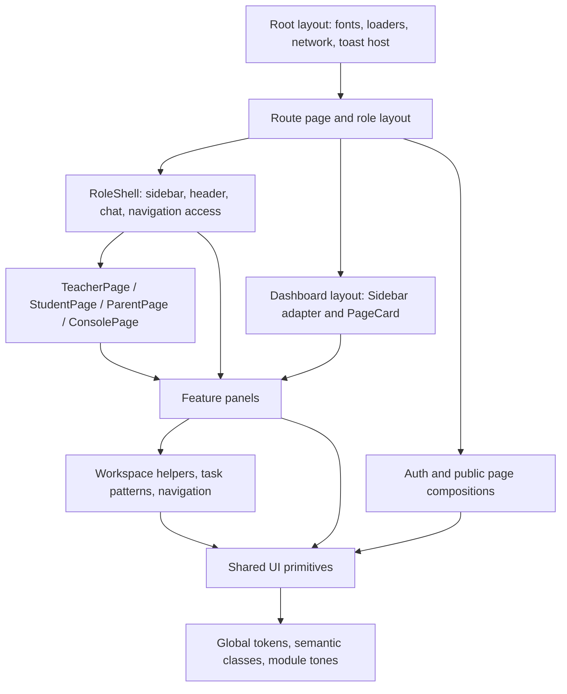

# UI architecture and ownership

UI already has a shared foundation. Pages choose data and compose feature panels; shared components own repeated appearance and interaction. These are existing locations unless marked proposed.

## Composition map

This is a composition/ownership map, not a claim that every route renders every layer. Authentication and permissions remain in existing server helpers, actions, APIs, and route gates; hiding navigation is only a UI behavior.

## Where each responsibility lives

| Responsibility | Existing location | Implementation rule |
| --- | --- | --- |
| Global font, metadata, document, loader/network providers, toast host | `src/app/layout.tsx` | Keep app-wide providers here; do not mount a second toaster per page |
| Global colors, Tailwind aliases, field/focus/surface/table rules, motion | `src/app/globals.css` | Extend semantic tokens and classes here; inspect cascade order before changing a rule |
| Root toast configuration and status styles | `src/components/ui/app-toaster.tsx`, `src/app/globals.css` | One root host; page callers only emit notifications |
| Shared dialog action colors | `src/components/ui/action-tones.ts` | Shared ConfirmAction, ModalActions and discard action palettes; contrast verified on actual compiled colors |
| Overlay language publication | `src/hooks/use-document-locale.ts`, `use-overlay-messages.ts`, `src/lib/ui/overlay-messages.ts` | Observe the established document locale; framework copy only, caller content untouched |
| Reusable low-level controls | `src/components/ui/` | Import existing `Button`, `Input`, `Select`, etc.; add missing primitives here only when a real batch needs them |
| Visible role frame | `src/components/role-dashboard/RoleShell.tsx`, `RoleSidebar.tsx`, `RoleHeader.tsx` | Shared chrome changes happen here; preserve access provider, locale, chat, collapsed rail and mobile navigation |
| Older dashboard frame | `src/app/dashboard/layout.tsx`, `src/components/layout/sidebar.tsx`, `header.tsx` | The sidebar adapts `RoleSidebar`; layout and old page headers are still distinct. Audit before consolidating |
| Operational auth wrapper | `src/app/operational-layout.tsx` | Server session/suspension/locale wrapper, not the visual page frame |
| Teacher role frame and data | `src/app/teacher/layout.tsx`, `teacher-shell.tsx`, `teacher-data-context.tsx` | Layout provides session check and context; shell uses `RoleShell`; preserve provider lifetime |
| Student role frame and data | `src/app/student/layout.tsx`, `student-shell.tsx`, `student-data-context.tsx` | Retain role/student/parent context and existing access checks |
| Parent role frame and data | `src/app/parent/layout.tsx`, `parent-shell.tsx`, `parent-data-context.tsx` | Preserve linked-child selection and tenant scope |
| Repeated role page composition | `src/components/teacher/teacher-page.tsx`, `student/student-page.tsx`, `parent/parent-page.tsx`, `operations/console-page.tsx` | Update shared spacing/header/content rules here; preserve wrapper APIs and scroll ownership |
| Reusable list workspaces | `src/components/shared-admin/workspace.tsx` | Own header, toolbar, filters, selection, sorting, table, pagination and saved view preferences |
| Navigation between related sections | `src/components/nav/WorkspaceSubnav.tsx`, `SectionSubnav.tsx` | Keep routed navigation as links; treat true in-page tab panels as a different interaction pattern |
| Feature colors | `src/lib/ui/module-tones.ts` | Extend existing tone mapping; do not assign arbitrary role-specific palettes |
| Locale and translated interface text | `src/components/locale/LocaleProvider.tsx`, `src/lib/locale/` | Reuse `useUiText`, `UiText`, locale package and formatters; preserve feature-local dictionaries where already used |
| Brand assets | `src/components/SkooleeLogo.tsx`, `SkooleeLogo.module.css`, `public/` | Preserve animated wordmark, cap/eyes, logo direction and existing icon assets |
| Development catalogue | `src/app/design-system/page.tsx`, `src/components/design-system/` | Extend reference examples and states; route stays development-only |
| Verification | `tests/design-system/`, `tests/locale/`, `tests/e2e/`, `docs/qa/` | Use the actual separate configs; new evidence belongs in the batch folder |

## Feature ownership

| Feature | UI location | Typical consumers |
| --- | --- | --- |
| Students, classes, staff administration and shared admin panels | `src/components/shared-admin/` | Admin, principal, super, older dashboard |
| Academic model, exams, grading, report pipeline | `src/components/academic/`, `src/components/academic/exams/` | Admin and principal, with teacher report/marks screens |
| Academic years and cycle management | `src/components/academic-year/` | Administrative consoles |
| Timetable and exam date sheets | `src/components/timetable/` | Admin/principal panels and teacher/student/parent timetable pages |
| Fees and finance | `src/components/fees/`, `src/components/billing/` | Accountant, admin, owner/super billing, family fee pages |
| Staff hierarchy | `src/components/staff/` | Administrative and staff-hierarchy pages |
| Library, transport, inventory, front desk and dormitory | `src/components/operations/` | Administrative and operations consoles |
| Messaging | `src/components/chat/`, `src/app/messages/` | Global dock and messages workspace |
| Analytics and insights | `src/components/analytics/`, `src/components/insights/` | Role dashboards and analytics screens |
| Attendance | `src/components/attendance/` and role attendance routes | Staff and family screens |
| Settings and locale | `src/components/settings/`, `src/components/locale/` | Admin/settings/member flows |
| Public marketing | `src/app/(public)/product-page.tsx`, `trust-page.tsx`, `src/components/marketing/PricingPage.tsx` | Public product, policy and pricing routes |
| Authentication | `src/app/(auth)/`, `src/components/auth/` | Login, registration, invite and account-protection flows |

`src/app/<route>/page.tsx` remains the route entry. Keep route-only helpers beside it when appropriate. Extract repeated feature UI into its existing feature folder; extract general controls into `ui/`. Do not create a new `shared/`, `common/`, or second design-system primitives directory.

## Dependency direction

Shared UI may depend on React, existing icon/utility packages, and established locale helpers. It must not import a feature page, Prisma, a tenant-specific data loader, or a role-specific business rule. Feature components may import shared UI and domain helpers. Route/layout components compose these and keep existing server/client boundaries.

The current high-level wrappers can retain their domain titles, icons and navigation. Reuse smaller header/content primitives only when the same contract occurs in more than one wrapper; do not replace all wrappers with a new universal component in the first batch.

## Shared files and parallel work

Assign one writer at a time to `globals.css`, UI primitives, `RoleShell`, locale message registries, and shared-admin workspace helpers. Other workers can audit feature pages and prepare evidence while the foundation changes. Once shared APIs stabilize, page batches can proceed independently in distinct feature folders. Read the latest shared API before each migration.

Implementation is now on `codex/ui-shared-foundation` in the existing checkout. The source indexes describe the starting snapshot; current source and the implementation evidence index take precedence for changed components. Continue using one writer per shared file and small independently verified feature batches.
